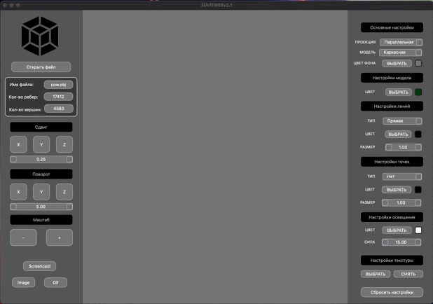
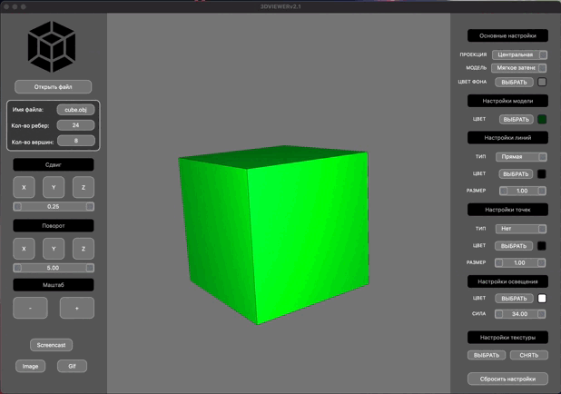
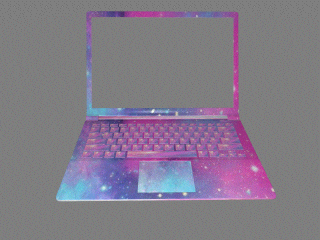
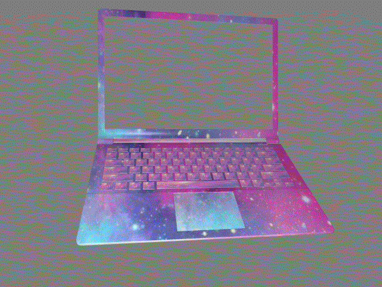

**The program allows you to open an .obj file and display the resulting model on the screen, as well as customize the resulting model (all options are described below).**

* The program has a graphical user interface, based on the GUI library with API for C++ - "Qt 6.2.3"
* The code is written according to google style
* Handling of exceptional situations
* The program is implemented using the MVC pattern
* The program uses design patterns such as:
  + Facade
  + Memento
  + Strategy
* There can only be one model on the screen at a time
* The programs provide the opportunity to:
  + Load a model from an obj file (vertex, surface and normal list support)
  + Move the model by a specified distance relative to the X, Y, Z axes with the right mouse button
  + Rotate the model by a specified angle relative to its X, Y, Z axes using the left mouse button
  + Scale the model
  + Switch the type of object display:
    - Frame model
    - Flat shading
    - Soft shading by Fong method
  + Set the light source, light intensity, light position and light color
  

  
* The graphical user interface contains:
  + Information about the loaded model - file name, number of vertices and edges
  + A button to select the file with the model and a field to display its name
  + The model visualization area
  + Buttons and input fields for moving the model
  + Buttons and input fields for model rotation
  + Buttons and input fields for model scaling
  

  
* The program allows you to customize:
  + The program allows you to adjust the type of projection (parallel and central)
  + The program allows you to adjust the type (solid, dashed), color and thickness of the edges, display method (absent, circle, square), color and size of the vertices
  + The program allows you to choose the background color
  + The program allows you to choose the background color of the object
* The settings are saved between program restarts

* The program allows you to save the captured ("rendered") images as 'bmp' and 'jpeg' files
* The program allows you to use a special button to record small "screencasts" - the current custom affine transformation of the loaded object into gif-animation (640x480, 10fps, 5s)

* The program allows you to use a special button to save a short preview of the model - gif-animation (640x480, 10fps, 5s) with the rotation of the object around one axis

* The program allows you to apply a texture to an object (texture mapping) that has a uv-mapping (uv-map)
* When you load a model with uv markup, the "Apply Texture" button becomes available, which allows you to select a texture file
* The texture file has a 'bmp' extension
* After the texture is loaded, the "Remove Texture" button becomes available in the program interface, after which the texture is unloaded from the program memory and is no longer displayed on the model

*** 

This project was developed by a students of School 21: tszechwa, xerminia, iseadra
